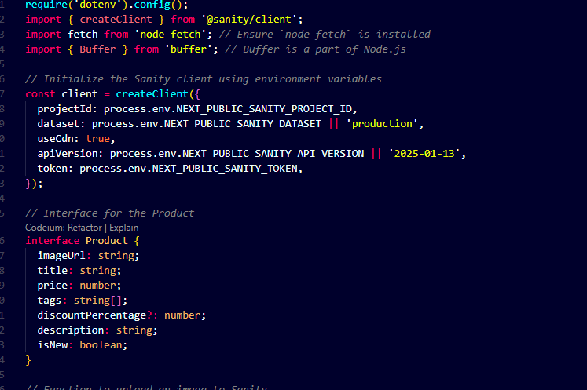
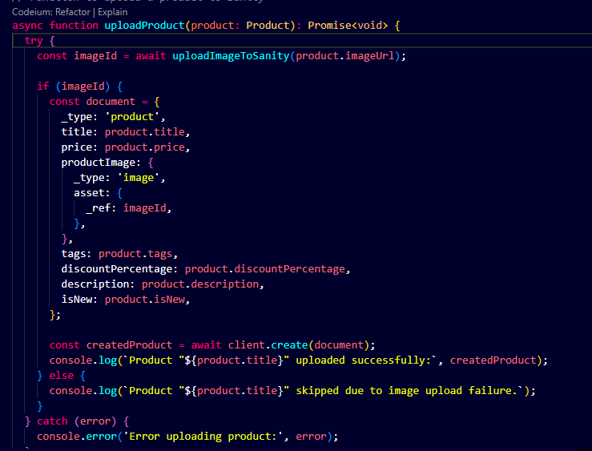
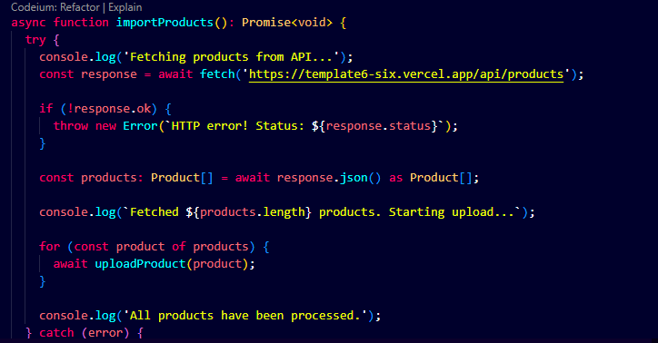
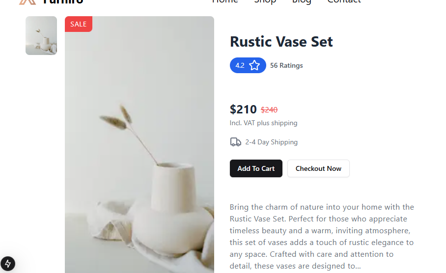
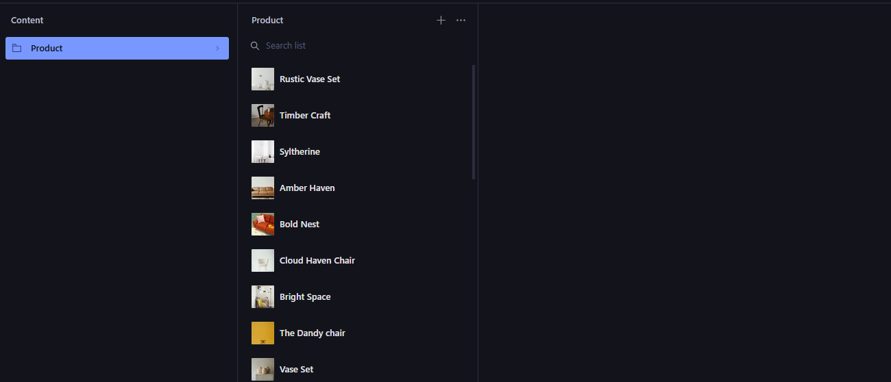

# Marketplace Builder Hackathon 2025 - Day 3 Submission

## API Integration and Data Migration

This document outlines the tasks completed during Day 3 of the Marketplace Builder Hackathon 2025, focusing on API integration and data migration for the e-commerce platform.

### Features Implemented
1. **Sanity Client Initialization**:
   - Integrated Sanity CMS using environment variables for secure access.
2. **Product Upload Functionality**:
   - Developed an `uploadProduct` function to upload products to Sanity CMS.
   - Handles image uploads and creates product documents dynamically.
3. **Data Import from External API**:
   - Implemented `importProducts` to fetch product data from an external API and upload to Sanity CMS.
4. **Frontend Integration**:
   - Displayed product listings with details such as image, price, description, and tags.
5. **Product Details Page**:
   - Detailed product pages showcasing images, descriptions, and pricing.

### Code Highlights
#### Sanity Client Setup
```typescript
const client = createClient({
  projectId: process.env.NEXT_PUBLIC_SANITY_PROJECT_ID,
  dataset: process.env.NEXT_PUBLIC_SANITY_DATASET || 'production',
  useCdn: true,
  apiVersion: process.env.NEXT_PUBLIC_SANITY_API_VERSION || '2025-01-13',
  token: process.env.NEXT_PUBLIC_SANITY_TOKEN,
});
```
#### Product Upload
```typescript
async function uploadProduct(product: Product): Promise<void> {
  try {
    const imageId = await uploadImageToSanity(product.imageUrl);
    if (imageId) {
      const document = {
        _type: 'product',
        title: product.title,
        price: product.price,
        productImage: {
          _type: 'image',
          asset: { _ref: imageId },
        },
        tags: product.tags,
        discountPercentage: product.discountPercentage,
        description: product.description,
        isNew: product.isNew,
      };
      const createdProduct = await client.create(document);
      console.log(`Product "${product.title}" uploaded successfully:`, createdProduct);
    } else {
      console.log(`Product "${product.title}" skipped due to image upload failure.`);
    }
  } catch (error) {
    console.error('Error uploading product:', error);
  }
}
```
#### Data Import
```typescript
async function importProducts(): Promise<void> {
  try {
    console.log('Fetching products from API...');
    const response = await fetch('https://template6-six.vercel.app/api/products');
    if (!response.ok) {
      throw new Error(`HTTP error! Status: ${response.status}`);
    }
    const products: Product[] = await response.json();
    console.log(`Fetched ${products.length} products. Starting upload...`);
    for (const product of products) {
      await uploadProduct(product);
    }
    console.log('All products have been processed.');
  } catch (error) {
    console.error('Error during product import:', error);
  }
}
```

### Screenshots
#### Code Implementation




#### Frontend Screenshots





